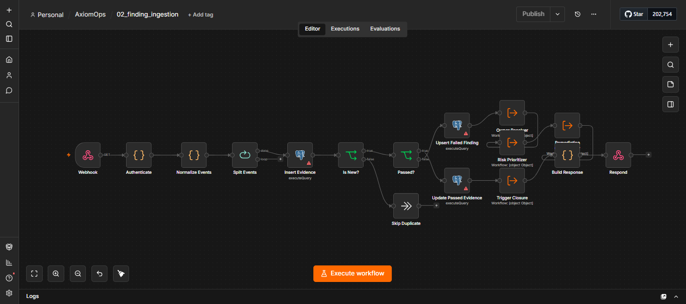

<div align="center">
  

  # AxiomOps Compliance Control Operations Suite
  
  *The intelligent orchestration layer for compliance, automating finding lifecycles from ingestion to remediation using n8n and PostgreSQL.*
  
  [](https://n8n.io)
  [](https://postgresql.org)
  [](https://ollama.com)
  [](https://atlassian.com)
</div>

---

## 📖 Table of Contents
- [Overview](#-overview)
- [Architectural Details](#-architectural-details)
- [Detailed Setup Guide](#-detailed-setup-guide)
- [Detailed Usage Guide](#-detailed-usage-guide)
- [Integration Points](#-integration-points)
- [Use Cases](#-use-cases)
- [Testing Framework](#-testing-framework)

---

## 🚀 Overview

**AxiomOps** acts as the orchestration layer between compliance scanning tools (like ComplianceGuard Pro) and your operational teams (via Jira, Slack, Teams, etc.). By centralizing compliance findings in a PostgreSQL database and running intelligent n8n workflows, AxiomOps ensures that security controls are tracked, owners are held accountable, and risk is quantified and managed efficiently.

---

## 🏗 Architectural Details

The suite consists of **11 interconnected n8n workflows** that form a robust, self-healing orchestration pipeline. 

### Core Database
A central **PostgreSQL** database acts as the single source of truth, storing assets, controls, findings, exception requests, and evidence events. This database-first architecture ensures durability, enables easy analytics, and provides state management across distinct workflow executions.

### Workflow Orchestration
1. **`00_error_handler.json`**: Global error catcher assigned to all workflows to gracefully handle and alert on failures.
2. **`01_registry_sync.json`**: Receives asset and control registry updates via webhook and upserts them into the database.
3. **`02_finding_ingestion.json`**: Main entry point for compliance findings. Validates evidence and triggers the pipeline for failed controls.
4. **`03_owner_resolver.json`**: Intelligently resolves ownership by checking the asset owner, falling back to the control owner, and finally using a configured default fallback owner.
5. **`04_risk_prioritizer.json`**: Calculates dynamic risk scores, priority levels (P1-P4), and SLA due dates based on asset criticality and control impact.
6. **`05_remediation_orchestrator.json`**: Creates and links Jira tickets for remediation tasks, respecting active risk exceptions.
7. **`06_exception_request.json`**: Webhook endpoint to request risk exceptions (accepting the risk for a specific time period).
8. **`06b_exception_decision.json`**: Webhook endpoint for managers/CISO to approve or reject exception requests.
9. **`07_aging_digest.json`**: Weekly scheduled digest of overdue tasks, unowned assets, and repeated findings, sent via messaging platforms.
10. **`08_closure_validator.json`**: Automatically closes findings and resolves tickets when consecutive passed evidence is received.
11. **`09_ollama_assistant.json`**: A local AI helper using Ollama for generating human-readable summaries and actionable advice. It features a safe fallback mechanism if the AI is unavailable.

---

## ⚙️ Detailed Setup Guide

Deploying AxiomOps requires configuring the central database, setting up environment variables, and importing the workflows into n8n in a specific order to maintain referential integrity.

### 1. Prerequisites
- **n8n Instance**: Self-hosted via Docker is recommended for full control over environment variables and execution limits.
- **PostgreSQL Database**: Version 14 or higher. This must be a dedicated database for compliance operations.
- **Ollama** (Optional): A local instance running the `llama3` or `mistral` model for AI-driven summaries.
- **Jira Account**: A service account with permissions to create and transition issues in your target project.

### 2. Database Provisioning
AxiomOps relies entirely on its schema for state management. 
1. Connect to your PostgreSQL server.
2. Create the database: `CREATE DATABASE complianceops;`
3. Execute the `schema.sql` script provided in the database setup folder. This will create the required tables:
   - `assets` (Tracks servers, repos, databases)
   - `controls` (Tracks security policies)
   - `findings` (Tracks active violations)
   - `evidence_events` (Append-only log of scanner results)
   - `exception_requests` (Tracks risk acceptance)

### 3. Environment Variables
AxiomOps workflows reference environment variables directly to keep sensitive data out of the JSON workflow definitions. Add these to your n8n `.env` file:

| Variable | Required | Default/Example | Purpose |
|----------|----------|-----------------|---------|
| `COMPLIANCEOPS_INGEST_TOKEN` | **Yes** | `your-secure-token` | Bearer token required by scanners to authenticate with the ingestion webhooks. |
| `COMPLIANCE_ADMIN_EMAIL` | **Yes** | `admin@example.com` | Fallback owner assigned to findings if asset/control owners are missing. |
| `COMPLIANCE_ESCALATION_EMAIL`| **Yes** | `ciso@example.com` | Receives alerts for P1 findings and exception request approvals. |
| `PUBLIC_WEBHOOK_URL` | **Yes** | `https://n8n.yourcorp.com` | Base URL used to generate clickable exception approval links. |
| `ALERT_WEBHOOK_URL` | **Yes** | `https://hooks.slack.com/...` | Webhook URL for Slack/Teams/Discord to send error alerts and aging digests. |
| `JIRA_URL` | **Yes** | `https://corp.atlassian.net`| Base URL of your Jira instance. |
| `JIRA_PROJECT_KEY` | **Yes** | `COMP` | The Jira project key where remediation tickets will be created. |
| `REQUIRED_CONSECUTIVE_PASSES`| No | `1` | Number of consecutive "passed" scans required before a finding is automatically closed. |

### 4. Importing Workflows
> [!IMPORTANT]
> To prevent "sub-workflow not found" errors, you **must** import the workflows in this exact order.

1. `00_error_handler.json`
2. `09_ollama_assistant.json`
3. `03_owner_resolver.json`
4. `04_risk_prioritizer.json`
5. `08_closure_validator.json`
6. `05_remediation_orchestrator.json`
7. `01_registry_sync.json`
8. `02_finding_ingestion.json`
9. `06_exception_request.json`
10. `06b_exception_decision.json`
11. `07_aging_digest.json`

### 5. Post-Import Configuration
1. **Credentials**: In the n8n UI, navigate to Credentials and create a new `PostgreSQL` credential matching your DB details. Create an `HTTP Header Auth` credential for Jira (Name: `Authorization`, Value: `Basic base64(email:api_token)`).
2. **Node Binding**: Open each workflow and ensure the PostgreSQL nodes are bound to your new credential.
3. **Error Handling**: For workflows `01` through `09`, go to workflow Settings → Error Handling, and set the `errorWorkflow` to the ID of the `00_error_handler` workflow.
4. **Activation**: 
   - First, activate the support/sub-workflows: `00`, `09`, `03`, `04`, `05`, `08`.
   - Then, activate the trigger workflows: `01`, `02`, `06`, `06b`, `07`.

---

## 🛠 Detailed Usage Guide

Once deployed, AxiomOps runs silently in the background, but compliance operators will interact with it daily via integrations and the database.

### 1. Ingesting Assets and Controls
Before sending findings, you must populate the registry.
- Send a `POST` request to the `01_registry_sync` webhook with your asset and control definitions. 
- If an asset is updated (e.g., owner changes), simply resend the payload. AxiomOps uses `UPSERT` logic to update existing records without creating duplicates.

### 2. Handling Exceptions
When an engineer cannot fix a finding immediately (e.g., waiting on a vendor patch), they can request an exception.
- The engineer sends a `POST` request to `06_exception_request` with the `finding_id`, `justification`, and `requested_days`.
- AxiomOps generates an approval link and sends it to the `COMPLIANCE_ESCALATION_EMAIL`.
- The CISO clicks the link (routing to `06b_exception_decision`), which sets the finding status to `risk_accepted` and pauses Jira escalations until the expiration date.

### 3. Reviewing the Aging Digest
Every Monday morning, the `07_aging_digest` workflow runs automatically.
- Check your configured Slack/Teams channel.
- Review the list of "Orphaned Findings" (missing owners) and "Overdue SLAs".
- Manually intervene in Jira or the DB for findings that are being ignored.

### 4. Manual Database Interventions
Sometimes operators need to override the system:
- **Force Close a Finding**: `UPDATE findings SET status = 'closed' WHERE id = 123;`
- **Reassign an Asset**: `UPDATE assets SET owner_email = 'new@corp.com' WHERE asset_id = 'srv-01';` *(AxiomOps will route new findings to the new owner automatically).*

---

## 🔌 Integration Points

AxiomOps is designed to be headless and integrate heavily with your existing stack.

### 1. Compliance Scanners (Inbound)
- **Endpoint**: `POST /webhook/finding-ingestion`
- **Auth**: `Authorization: Bearer $COMPLIANCEOPS_INGEST_TOKEN`
- **Payload Expectation**: Requires `asset_id`, `control_id`, `status` (passed/failed), and raw `evidence`.

### 2. Jira Software (Outbound)
- **Method**: HTTP Request node using REST API v3.
- **Auth**: Basic Auth (API Token).
- **Behavior**: When a finding is prioritized, a Jira Issue is created. The Issue Key is saved back to the `findings.jira_ticket_key` column. When the finding is closed, AxiomOps sends a transition request to Jira to mark the ticket "Done".

### 3. Messaging Platforms (Outbound)
- **Method**: Standard HTTP Webhooks (Slack/Discord/Teams).
- **Behavior**: Formatted markdown blocks are pushed for critical errors (via `00_error_handler`) and weekly digests (via `07_aging_digest`).

### 4. Local AI Summarization (Internal)
- **Method**: HTTP Request to `http://localhost:11434/api/generate` (Ollama default).
- **Behavior**: When complex evidence is ingested, `09_ollama_assistant` asks the local model to summarize the technical jargon into a 2-sentence explanation for the Jira ticket. 
> [!NOTE]
> If the AI is down or times out, a hardcoded fallback string is used to prevent the pipeline from failing.

---

## 💡 Use Cases

### 1. Automated Compliance Monitoring & Alerting
- **Input**: A vulnerability scanner runs a daily cron job and detects that `web-prod-01` is missing a critical OS patch.
- **Process**: The scanner pushes a JSON payload to `02_finding_ingestion`. The workflow logs the failure, looks up the owner of `web-prod-01` via `03_owner_resolver`, and calculates the risk score via `04_risk_prioritizer`.
- **Output**: A Jira ticket is created and assigned to the server owner, and a Slack alert is fired to the Security Operations channel.

### 2. Risk Prioritization and SLA Enforcement
- **Input**: Two distinct failures occur: A critical production database fails a backup control, and a development sandbox fails a resource tagging control.
- **Process**: The `04_risk_prioritizer` evaluates the `asset_criticality` and `control_impact` matrices stored in the database.
- **Output**: The production database finding is assigned a `P1` priority with a 24-hour SLA. The dev sandbox is assigned a `P4` priority with a 14-day SLA. Tickets are created reflecting these deadlines.

### 3. Exception Management (Risk Acceptance)
- **Input**: An engineer determines that patching a legacy application will break production, and they need 6 months to refactor the code.
- **Process**: The engineer triggers the `06_exception_request` webhook. The workflow identifies the CISO's email and sends a structured approval request. The CISO clicks "Approve" (hitting `06b_exception_decision`).
- **Output**: The finding in the database is marked `risk_accepted`. The `05_remediation_orchestrator` will skip this finding during daily sweeps, preventing spam Jira tickets until the 6-month period expires.

### 4. Automated Validation and Closure
- **Input**: The engineer finally applies the patch to the server. The vulnerability scanner runs its daily sweep and finds the server is now compliant.
- **Process**: The scanner sends a "passed" payload to `02_finding_ingestion`. The `08_closure_validator` kicks in, checks the `REQUIRED_CONSECUTIVE_PASSES` environment variable, and confirms the criteria are met.
- **Output**: The finding is marked `closed` in the database, and an API call is made to Jira to automatically transition the remediation ticket to "Done".

---

## 🧪 Testing Framework

AxiomOps comes with a fully automated, zero-dependency testing framework powered by the **n8n Model Context Protocol (MCP)** server.

### Running Tests
You can run the full suite (Smoke, Unit, and Stress tests) using the provided Python scripts:
```powershell
cd Tests/AxiomOps_Tests/scripts
python mcp_test_runner.py
```

This framework tests the logic of the workflows directly by injecting data into the trigger nodes via MCP, bypassing the need for a live database or active webhooks during the test. A detailed report is generated at `mcp_test_report.json`.
